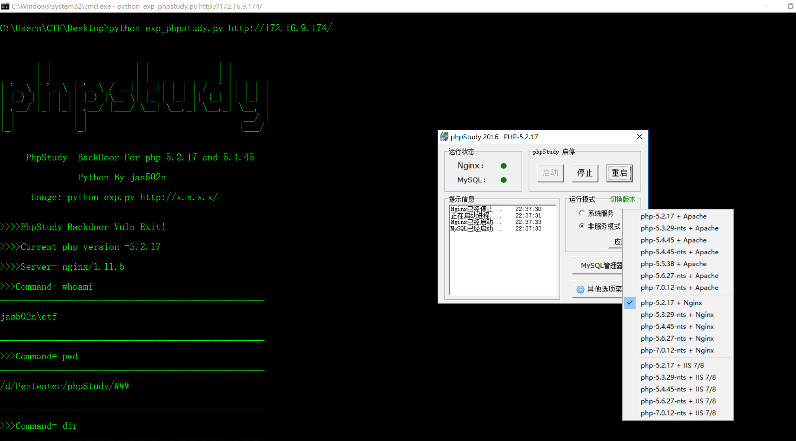
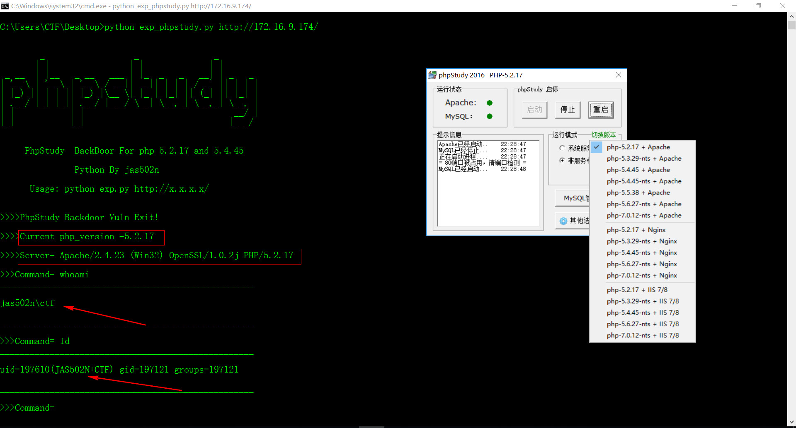
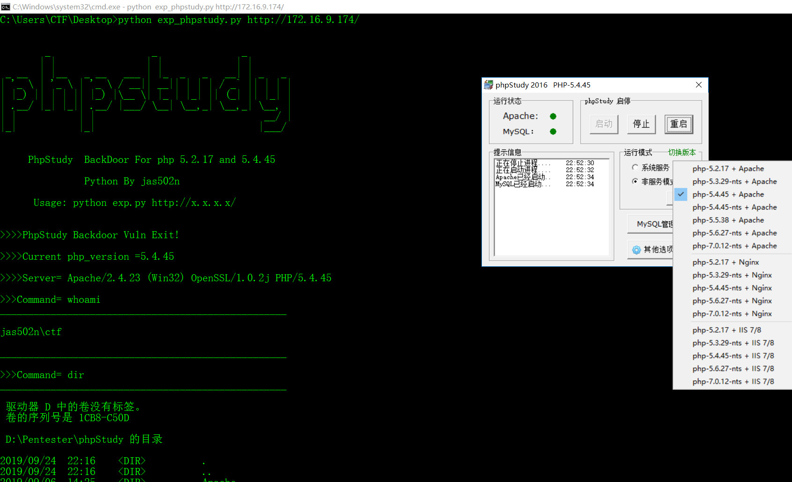

# PHPStudy-Backdoor 后门漏洞复现
phpstudy dll backdoor for v2016 and v2018



## 0x01 scan search for backdoor dll

```
D:\Pentester\phpStudy>python check.py
=== .\php\php-5.2.17\ext\php_xmlrpc.dll ===
@eval(%s('%s'));
%s;@eval(%s('%s'));
=== .\php\php-5.4.45\ext\php_xmlrpc.dll ===
@eval(%s('%s'));
%s;@eval(%s('%s'));

D:\Pentester\phpStudy>

>>>D:\Pentester\phpStudy\php\php-5.2.17\ext\php_xmlrpc.dll
>>>D:\Pentester\phpStudy\php\php-5.4.45\ext\php_xmlrpc.dll


D:\Pentester\phpStudy>md5sum .\php\php-5.2.17\ext\php_xmlrpc.dll
\0f7ad38e7a9857523dfbce4bce43a9e9 *.\\php\\php-5.2.17\\ext\\php_xmlrpc.dll

D:\Pentester\phpStudy>md5sum  .\php\php-5.4.45\ext\php_xmlrpc.dll
\c339482fd2b233fb0a555b629c0ea5d5 *.\\php\\php-5.4.45\\ext\\php_xmlrpc.dll
```

## 0x02 exp

```Ps： 脚本编写思路:
1.先检测目标网站php版本，再执行命令，以及输出目标网站的server信息
2. 生成固定字符串md5,验证是否成功执行
```







## 参考链接

https://mp.weixin.qq.com/s/dIDfgFxHlqenKRUSW7Oqkw
